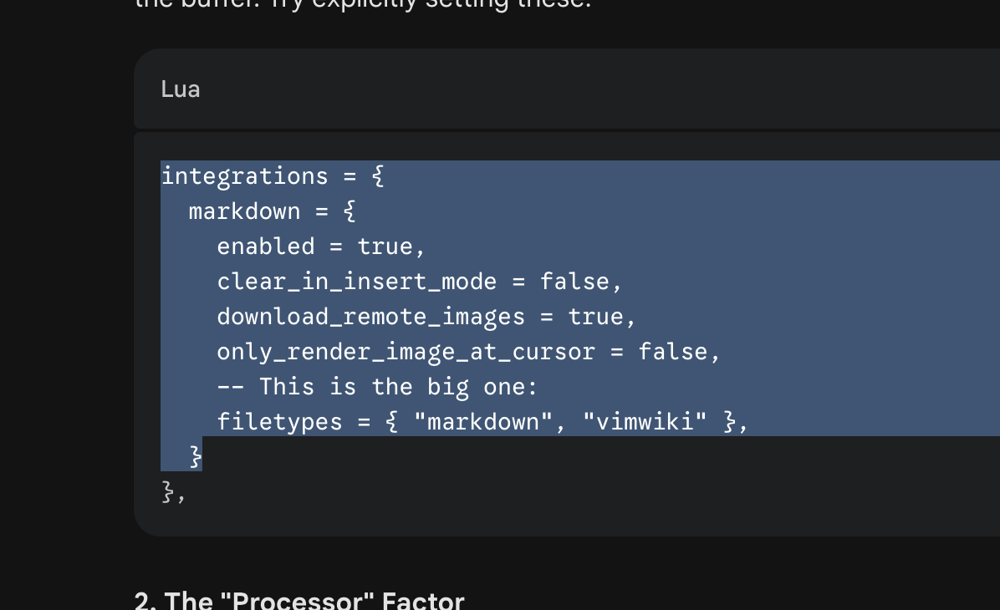

# Project: Hen Egg White Lysozyme Simulation
**Date:** 5 March 2026
**Researcher:** jsesate
**Environment:** Gemini HPC

## 0. Environment Setup
[Lysozyme Tutorial](http://www.mdtutorials.com/gmx/lysozyme/01_pdb2gmx.html)
Recorded aliases and configuration used for this project (in .bash.rc):
- File Transfer: alias hpush='rsync -avzP' 
- SSH Alias: `hpc` (gemini-login1.rc.tgen.org)
- Node Accessed: alias dev="srun --gres gpu:1 -N 1 -n 1 -c 4 --mem 100GB --partition=gpu-v100-dev --time=2:00:00 --pty bash -i"
- Working Directory: `/scratch/jsesate/lysozyme_sim`

## 1. Data Acquisition and Preliminary Visualization
Downloaded the crystal structure of hen egg white lysozyme (PDB ID: 1AKI) from RCSB. Subsequently visualized the PDB file with ChimeraX:
- Source: [RCSB 1AKI](https://www.rcsb.org/structure/1AKI)
- Format: Legacy PDB
- Visualization: [1AKI](assets/1AKI_start.png)

## 2. Pre-processing
Uploaded raw data to HPC and removed crystal waters (HOH residues) to prepare the protein for GROMACS.

```{local - bash}
hpush ~/Downloads/1AKI.pdb hpc:/scratch/jsesate/lysozyme_sim/
```

## 3. Connect to HPC and spin up a GPU node in the working directory
ssh hpc
cd /scratch/jsesate/lysozyme_sim/
dev
module purge
module load Gromacs/2023.2-Container

# Record of Tutorial Commands
## 1. Strip crystal waters
```{bash}
grep -v HOH 1AKI.pdb > 1AKI_clean.pdb
```
## 2. Downloaded force field tarball and placed in working directory:
- Force Field: [charmm36-feb2026_cgenff-5.0.ff.tar](https://mackerell.umaryland.edu/charmm_ff.shtml#gromacs)

## 3. Creating topology
Running the following command prompts you to choose a force field option. Since our tarball is our working directory, we choose option 1:
```{bash}
gmx pdb2gmx -f 1AKI_clean.pdb -o 1AKI_processed.gro -water tip3p 
```

At this point, we have the necessary files ready for Gromacs simulation:
- 1AKI_processed.gro
- pasre.itp
- topol.top

1AKI_processed.gro is a GROMACS-formatted structure file that contains all the atoms defined within the force field (i.e., H atoms have been added to the amino acids in the protein). You can also choose to create a .pdb instead of a .gro, it's just that .gro is the default.

The topol.top file is the system topology. 

The posre.itp file contains information used to restrain the positions of heavy atoms (more on this later).

## 4. Defining box and filling it with solvent (water)
```{bash}
gmx editconf -f 1AKI_processed.gro -o 1AKI_newbox.gro -c -d 1.2 -bt cubic
gmx solvate -cp 1AKI_newbox.gro -cs spc216.gro -o 1AKI_solv.gro -p topol.top
```

## 5. Adding ions to balanced the net charge of 8.0

Added an inputs directory with ion.mdp whose contents are parameters for adding in the ions. 
- [ions.mdp](http://www.mdtutorials.com/gmx/lysozyme/Files/ions.mdp)

What grompp does is process the coordinate file and topology (which describes the molecules) to generate an atomic-level input (.tpr). The .tpr file contains all the parameters for all of the atoms in the system.
```{bash}
gmx grompp -f inputs/ions.mdp -c 1AKI_solv.gro -p topol.top -o ions.tpr
```
What genion does is read through the topology and replace water molecules with the ions that the user specifies. The input is called a run input file, which has an extension of .tpr; this file is produced by the GROMACS grompp module (GROMACS pre-processor). 

The group SOL was chosen after running this command so that ions are replaced in the solvent not in our protein.
```{bash}
gmx genion -s ions.tpr -o 1AKI_solv_ions.gro -p topol.top -pname NA -nname CL -neutral
```

Our topology now has our protein, our water solvent, and 8 chlorine ions.

## 6. Running energy minimization simulation

Recompiled a .tpr now based on our new topology with the following minimization .mdp from the tutorial:
- [minim.mdp](http://www.mdtutorials.com/gmx/lysozyme/Files/minim.mdp)
```{bash}
gmx grompp -f inputs/minim.mdp -c 1AKI_solv_ions.gro -p topol.top -o em.tpr
```

Now that we have .tpr, we ran the energy minimization:
```{bash}
gmx mdrun -v -deffnm em
```
This produces the following files:
- em.log: ASCII-text log file of the EM process
- em.edr: Binary energy file
- em.trr: Binary full-precision trajectory
- em.gro: Energy-minimized structure

This is the output I got after running:
```
Steepest Descents converged to Fmax < 1000 in 716 steps
Potential Energy  = -6.1463944e+05
Maximum force     =  9.8959296e+02 on atom 112
Norm of force     =  1.9599504e+01
```
Epot should be negative, and (for a simple protein in water) on the order of 105-106, depending on the system size and number of water molecules. The second important feature is the maximum force, Fmax, the target for which was set in minim.mdp - "emtol = 1000.0" - indicating a target Fmax of no greater than 1000 kJ mol-1 nm-1. 

# Analysis of energy minimization

I ran
```
gmx energy -f em.edr -o potential.xvg
```
and typed "10 0" for Potential analysis


# Image Test


Check if the logo appears above.

