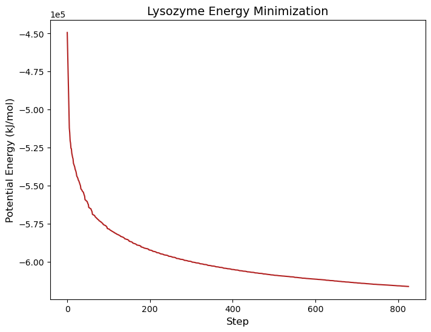
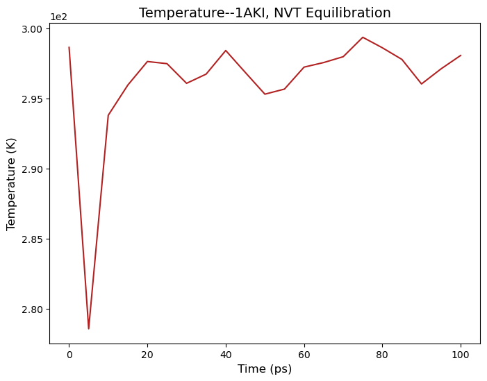
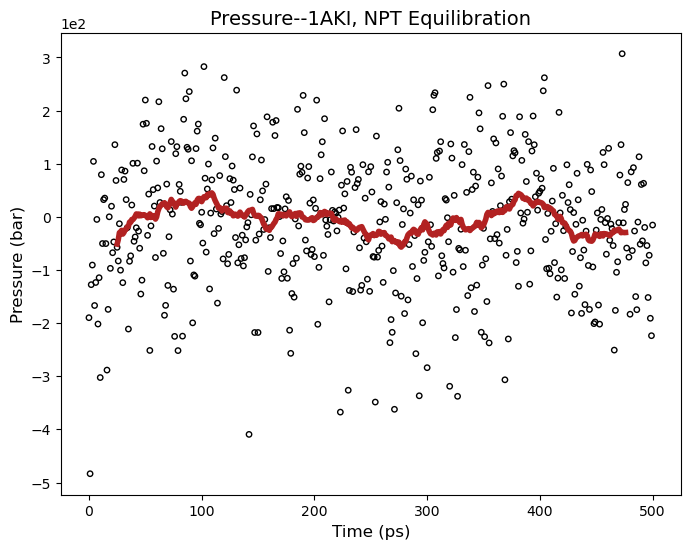
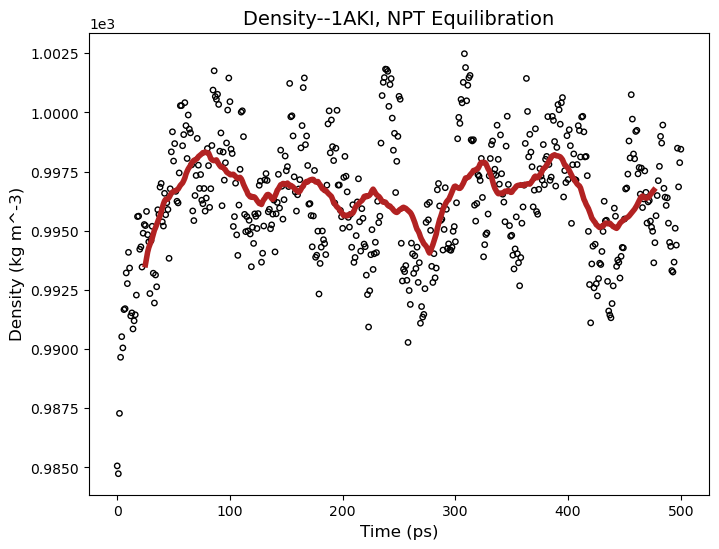

# Project: Hen Egg White Lysozyme Simulation
**Date:** 5 March 2026
**Researcher:** jsesate
**Environment:** Gemini HPC

## 0. Environment Setup
[Lysozyme Tutorial](http://www.mdtutorials.com/gmx/lysozyme/01_pdb2gmx.html)
Recorded aliases and configuration used for this project (in .bash.rc):
- File Transfer: alias hpush='rsync -avzP' 
- SSH Alias: `hpc` (gemini-login1.rc.tgen.org)
- Node Accessed: alias dev="srun --gres gpu:1 -N 1 -n 1 -c 4 --mem 100GB --partition=gpu-v100-dev --time=2:00:00 --pty bash -i"
- Working Directory: `/scratch/jsesate/lysozyme_sim`

## 1. Data Acquisition and Preliminary Visualization
Downloaded the crystal structure of hen egg white lysozyme (PDB ID: 1AKI) from RCSB. Subsequently visualized the PDB file with ChimeraX:
- Source: [RCSB 1AKI](https://www.rcsb.org/structure/1AKI)
- Format: Legacy PDB

To learn about any command from gmx, you can run
```bash
gmx (module) -h
```
where (module) is the command of interest (ex: pdb2gmx)

## 2. Pre-processing
Uploaded raw 1AKI.pdb to HPC.

```bash
hpush ~/Downloads/1AKI.pdb hpc:/scratch/jsesate/lysozyme_sim/inputs
```

## 3. Connect to HPC and spin up a GPU node in the working directory
```bash
ssh hpc
cd /scratch/jsesate/lysozyme_sim/
dev
module purge
module load Gromacs/2023.2-Container
```

# Record of Tutorial Commands
## 1. Strip crystal waters

```bash
grep -v HOH inputs/1AKI.pdb > 1AKI_clean.pdb
```

## 2. Downloaded CHARMM force field tarball and placed in input directory:
- Force Field: [charmm36-feb2026_cgenff-5.0.ff.tar](https://mackerell.umaryland.edu/charmm_ff.shtml#gromacs)
## 3. Creating force-field compliant topology

Prepare the topology by running the following command:

```bash
gmx pdb2gmx -f 1AKI_clean.pdb -o 1AKI_processed.pdb -water tip3p 
```

At this point, we have the necessary files ready for Gromacs simulation:
- 1AKI_processed.gro
- pasre.itp
- topol.top

1AKI_processed.pdb is the protonated structure of our original 1AKI.pdb file. The help page gives details as to how these structures are protonated and what options you could choose instead.

The posre.itp file contains information used to restrain the positions of heavy atoms (more on this later).

The topol.top file is the system topology which contains all information required to run a simulation based and specifies that we will be using the CHARMM force field.

### Qs:
- Why do we exclude nonbonding interactions for atoms that are up to 3 bonds away with the AMBER ff?
- type designates Leonard Jones potential chosen for each atom. What do values of CT, HP, or N3 mean and why do atoms get assigned these values?
- We protonate different residues based either interactively or by the default values. Can we simulate different pH values in a straightforward way?
- What's with the "special" 1-4 interactions that occurs in the [ pairs ] section.
- Why do we only restraint heavy atoms?
- How do we justify the use of different water molecule models?

## 4. Defining box and filling it with solvent (water)
```bash
gmx editconf -f 1AKI_processed.pdb -o 1AKI_newbox.pdb -c -d 1.2 -bt cubic
gmx solvate -cp 1AKI_newbox.pdb -cs spc216.gro -o 1AKI_solv.pdb -p topol.top
```

editconf added H values accordingly to the atom column of the pdb file. Not sure where the box params are saved within it though.

solvate took our boxed and centered protein in 1AKI_newbox.pdb and added in our 3-point water molecule solvent, removing any water molecules whose van der waals radii would have overlapped with the protein's atoms. Also updates topol.top with solvent!

### Qs:
- How do you justify your choice in box type? There seems to be many options. My hunch is that you choose based on what gives you the least solvent molecules while our 1.2nm distance from all atoms to one another remains intact to prevent spurious periodic forces.
- Why do we need to specify -cs spc216.gro when we already set the water model in the topology? How is this different?

## 5. Adding ions to balanced the net charge of 8.0

Added an inputs directory with ion.mdp whose contents are parameters for adding in the ions. 
- [ions.mdp](http://www.mdtutorials.com/gmx/lysozyme/Files/ions.mdp)

What grompp does is process the coordinate file and topology (which describes the molecules) to generate an atomic-level input (.tpr). The .tpr file contains all the parameters for all of the atoms in the system.

The resulting .tpr is a binary ready for input into MD.

```bash
gmx grompp -f inputs/ions.mdp -c 1AKI_solv.pdb -p topol.top -o ions.tpr
```

What genion does is read through the topology and replace water molecules with the ions that the user specifies. The input is called a run input file, which has an extension of .tpr; this file is produced by the GROMACS grompp module (GROMACS pre-processor). 

The group SOL was chosen after running this command so that ions are replaced in the solvent not in our protein.
```bash
gmx genion -s ions.tpr -o 1AKI_solv_ions.pdb -p topol.top -pname NA -nname CL -neutral
```

Our topology now has our protein, our water solvent, and 8 chlorine ions.

### Qs:
- Why do we generate ions after the water molecules by replacing them? If we had many ions, couldn't this mess up the solvent? I imagine that ions are largely different shapes and sizes than the water molecule models generate by solvate. By introducing ions post solvation, couldn't this introduce extra/lower density than intended of solvent? Maybe it's just negligible most of the time...
- The parameters given for the .tpr in the .mdp were indicated to have been only appropriate for the CHARMM36 force field. How do we know that these parameters worked for our choice of the AMBER force field?
- What does it mean to have an "atomic" definition rather than a molecular when we are defining the .tpr? The file is a binary, so I can't just look at it.
- Since ion addition is random, do you usually set seed with -seed? How important would this usually be? The grompp command can also be passed a seed. What about it is randomized?
- It doesn't say, but does genion also add ions to the ion.tpr? What was the point of making the .tpr for ion generation when we just make em.tpr later for the actual simulation?

## 6. Running energy minimization simulation

Recompiled the em.tpr now based on our new topology with the following minimization .mdp from the tutorial:
- [minim.mdp](http://www.mdtutorials.com/gmx/lysozyme/Files/minim.mdp)

```bash
gmx grompp -f inputs/minim.mdp -c 1AKI_solv_ions.pdb -p topol.top -o em.tpr
```

Now that we have the em.tpr with the minimization parameters, we can run the energy minimizaiton step.

Note: only difference between ions.mdp and minim.mdp is that coulombtype was changed from cutoff to PME.

```bash
gmx mdrun -v -deffnm em -c em.gro
```

This produces the following files:
- em.log: ASCII-text log file of the EM process
- em.edr: Binary energy file
- em.trr: Binary full-precision trajectory
- em.gro: Energy-minimized structure

This is the output I got after running:
```
Steepest Descents converged to Fmax < 1000 in 759 steps
Potential Energy  = -6.1520319e+05
Maximum force     =  8.8771802e+02 on atom 112
Norm of force     =  1.8983993e+01
```

Epot should be negative, and (for a simple protein in water) on the order of 105-106, depending on the system size and number of water molecules. The second important feature is the maximum force, Fmax, the target for which was set in minim.mdp - "emtol = 1000.0" - indicating a target Fmax of no greater than 1000 kJ mol-1 nm-1. 

### Qs:
- Why did we need to change coulombtype from cutoff to PME in the .mdp (going from ions.mdp to minim.mdp)?
- Do we always use the 1000kJ mol^-1 nm^-1 cutoff for max force? When do we use a different max force target cutoff?

## 7. Analysis of energy minimization

I ran
```bash
gmx energy -f em.edr -o potential.xvg
mv potential.xvg outputs/
```
and typed "10 0" for Potential analysis.

Then I generated the following plot with matplotlib in viz.qmd from the resulting potential.xvg:


## 8. NVT Equilibration

Using the posre.itp from earlier, we will equilibrate the solvent to our protein while keeping the protein heavy atoms restrained.

Equilibration occurs in two stages. The first is via the "isotheramal-isochoric" or "canonical" or "NVT" ensemble which brings our system to the desired temperature.

```bash
gmx grompp -f inputs/nvt.mdp -c em.pdb -r em.pdb -p topol.top -o nvt.tpr
gmx mdrun -deffnm nvt -c nvt.pdb
```

This runs for 50000 steps for a total of 100.0 ps and results in the final coordinates:
```
              Core t (s)   Wall t (s)        (%)
       Time:      109.892       27.492      399.7
                 (ns/day)    (hour/ns)
Performance:      314.279        0.076
```

Analyzing the energy file nvt.edr,
```bash
gmx energy -f nvt.edr -o temperature.xvg
mv temperature.xvg outputs/
```
and selecting 15 0 for temperature we obtain another .xvg which I visualized in viz.qmd once again to produce


## 9. NPT Equilibration

Similar to NVT, we equilibrate to our pressure of interest.

```bash
gmx grompp -f inputs/npt.mdp -c nvt.pdv -r nvt.pdb -t nvt.cpt -p topol.top -o npt.tpr
gmx mdrun -deffnm npt -c npt.pdb
```

The NPT equilibration step ran for 250000 steps and 500.0 ps resulting in the final coordinates:


Analyzing the energy file npt.edr for pressure and density,
```bash
gmx energy -f npt.edr -o pressure.xvg
mv pressure.xvg outputs/
gmx energy -f npt.edr -o density.xvg
mv density.xvg outputs/
```
and selecting 22 0 for pressure and 16 0 for density, we obtain the following two plots via the same vizualization procedure as before in viz.qmd:





## 10. MD simulation for 10-ns!

```bash
gmx grompp -f inputs/md.mdp -c npt.pdb -t npt.cpt -p topol.top -o md_0_10.tpr
gmx mdrun -deffnm md_0_10
```

For practice, I also ran the mdrun command above in a bash script: md.sh, which I submitted via sbatch.

The MD simulation ran for 5000000 steps and 1000.0 ps.

Finally, we made sure the protein was centered over the whole simulation, accounting for periodicity:
```bash
gmx trjconv -s md_0_10.tpr -f md_0_10.xtc -o md_0_10_noPBC.xtc -pbc mol -center
```

## 11. MD Simulation Analysis!

RMSD data on the equilibrated .tpr vs the crystal .tpr
```bash
gmx rms -s md_0_10.tpr -f md_0_10_noPBC.xtc -o rmsd.xvg -tu ns
gmx rms -s em.tpr -f md_0_10_noPBC.xtc -o rmsd_xtal.xvg -tu ns
```
choosing 4 ("Backbone") for least squares and RMSD
